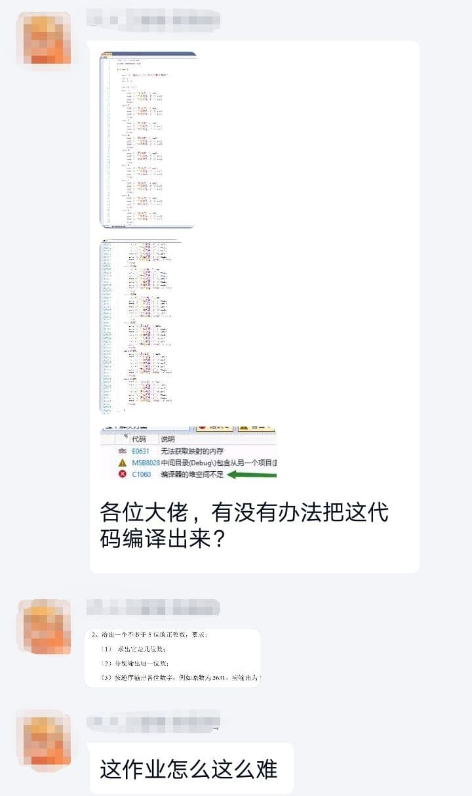
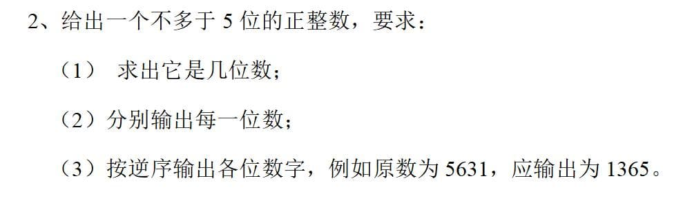
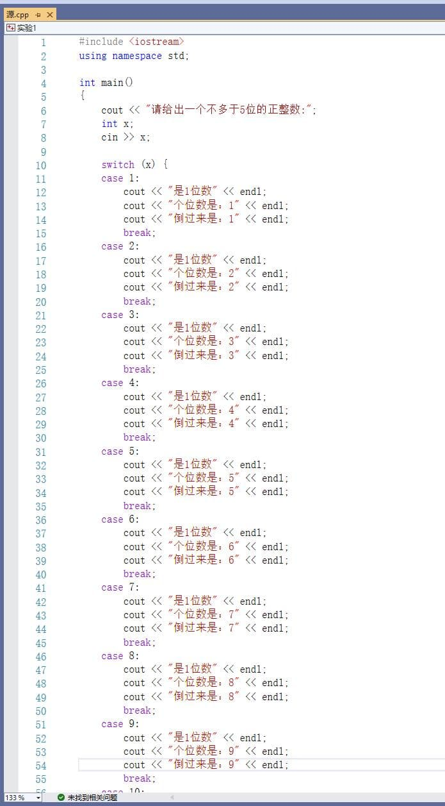
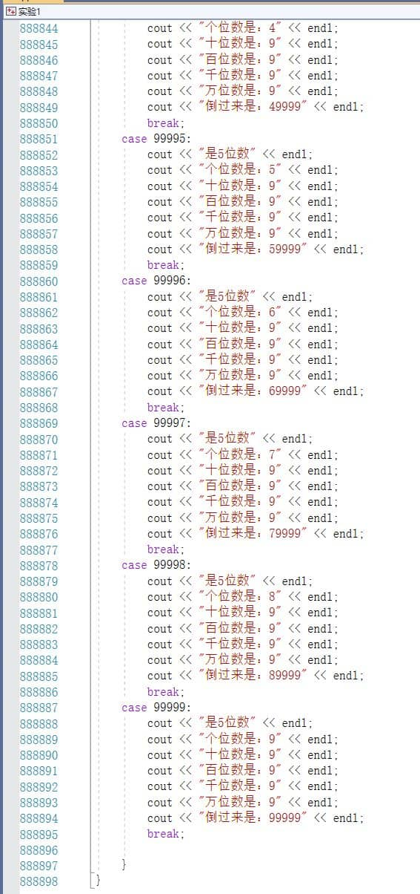
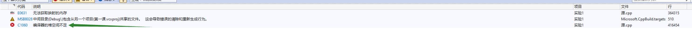

# 800k lines cpp compile challenge

80万行cpp编译挑战

800k lines cpp 编译 challenge

## generate 生成Cpp代码

`go run generator.go`

## compile 编译Cpp代码

`g++ -m64 main.cpp`

## binary test 二进制测试

`./a.out`

## pregenerate code 预生成代码

For challengers without a `golang` environment, the `main.7z` in the project is the generated cpp code.

对于没有`golang`环境的挑战者，项目中的`main.7z`便是已经生成好的cpp代码。

## Story 缘起

There are several pictures circulating in the community. It depicts a student who has written over 800,000 lines of code to complete an assignment, but cannot get it to compile.

社群流传着几张图片。描述了一个学生为了完成作业而写下了80万行代码，但是无法通过编译。

The assignment requires you to enter a number with no more than 5 digits, output each digit separately, and then output the numbers in reverse order.

作业的要求是输入一个不超过5位的数字，分别输出每一位，再将数字倒序输出。

Obviously, we know that his code was generated and not handwritten. And he was probably just trying to make a joke.

But we can still take on the challenge of compiling this code.

显然，我们知道他的代码是生成的而非手写的。而且他应该只是想开个玩笑。

但是我们还是可以来挑战一下编译这个代码。

